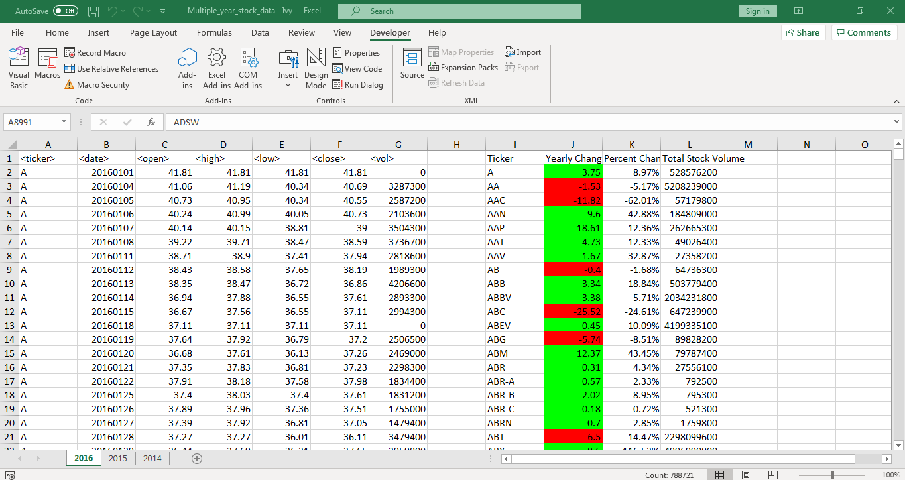
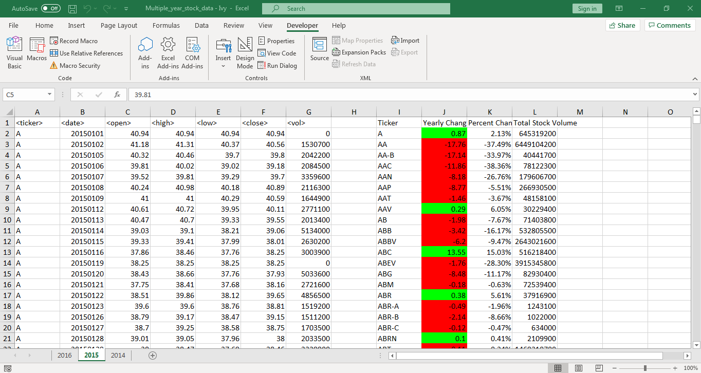
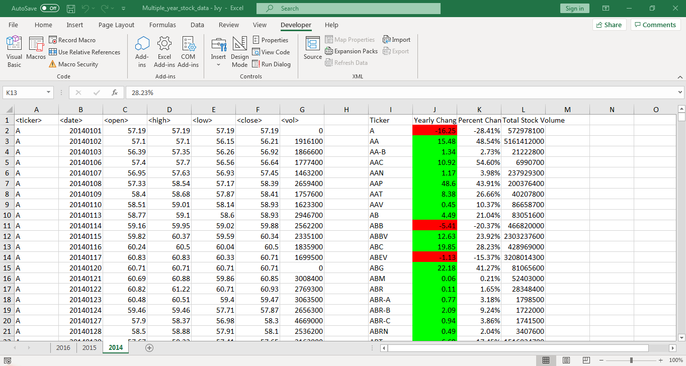

<<<<<<< HEAD
# 2016 screenshot

# 2015 screenshot

# 2014 screenshot

=======
# VBA-Stock-Analysis
# All files and screenshots are in the VBAStocks folder
>>>>>>> 94b2acf4fdb0aa1c4888be7150f6bb23f7087a02
